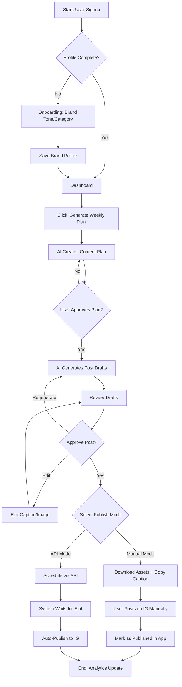

# Live PRD: AI Social Media “Agency Bot” for Indian SMBs

**Status:** Live / In-Progress  
**Tech Stack:** Next.js (App Router), Node.js, PostgreSQL, Inngest/BullMQ, LLM usage (Gemini/Claude).  
**Original Vision:** "Agency outcomes at SaaS prices."

---

## 1) Problem Statement
Indian SMBs struggle with consistent content creation and posting on Instagram/WhatsApp. They cannot afford agencies (₹15k+) but need agency-like results (strategy, regularity, professional tone).

**Target User:** Non-technical solo founders (D2C, Food, Fashion) who are "Instagram-first".

---

## 2) MVP Scope & Feasibility Adjustments

### 2.1 Core Job-to-be-Done
"Help me plan, create, schedule, and publish on Instagram reliably, in my brand voice, and nudge me to follow up."

### 2.2 Feature Specifications (Revised)

#### 1. Account Setup & Brand Profile
*   **Input:** Business category, brand tone, audience, catalog highlights.
*   **Technical Implementation:** Simple onboarding form wizard.
*   **Output:** structured JSON profile stored in Postgres.

#### 2. Content Ideation & Drafts
*   **Feature:** Generate weekly plan + post drafts (Caption, Hashtags, Image Prompt).
*   **Tech Adjustment:** 
    *   ~~Workflow Orchestration: n8n~~ -> **REJECTED**. Too fragile for user-facing logic.
    *   **New Approach:** **Next.js Server Actions + LangChain/LLM SDK**. We will control the prompt chains in code for reliability and testing.
    *   **Image Strategy:** MVP will focus on **User Uploaded Images** or **Stock/AI Image Generation (optional/later)**. *Note: Most SMBs want to post their OWN products. We should prioritize "Captioning your photo" loops first.*

#### 3. Scheduling & Publishing
*   **Feature:** Connect IG, Schedule, Publish.
*   **Tech Adjustment:**
    *   ~~One-tap schedule (Day 1)~~ -> **RISK**. Requires strict Meta App Review.
    *   **New Approach:** **Hybrid Model**.
        1.  **Manual Mode (P0):** "Copy Caption", "Download Image", "Open Instagram" button. (Guarantees usability if API approval is delayed).
        2.  **API Mode (P1):** Official Instagram Graph API for auto-publishing.
        3.  **Scheduling Engine:** **Inngest** or **QStash** (Serverless scheduling) instead of maintaining cron jobs.

#### 4. Behavioral Nudges (WhatsApp)
*   **Feature:** Reminders to approve/post.
*   **Tech Adjustment:**
    *   ~~Two-way "Reply to Approve"~~ -> **DEFER**. Requires high-friction "Embedded Signup" for every SMB user to link their generic phone number, plus per-conversation pricing.
    *   **New Approach:** **One-Way Notifications**. System sends: *"Your Tuesday post is ready. Tap to review."* -> User clicks link -> Opens Web App to approve.
        *   *Cost:* Uses Authentication/Utility templates (cheaper).
        *   *Setup:* We can potentially use our own Business Number to notify (if allowed by ToS) or email/push fallback until Phase 2. **For MVP Validation: Browser Push Extensions or PWA Notifications are free alternatives.**

#### 5. Customer Follow-ups
*   **Feature:** Draft response suggestions.
*   **Tech Adjustment:**
    *   ~~Auto-detect comments/DMs~~ -> **COMPLEXITY**. Requires webhooks and heavy permission scopes.
    *   **New Approach:** **"Paste Context" Tool**. User copies a nasty comment or DM -> pastes it in App -> AI suggests 3 responses (Polite, Professional, Witty).

### 2.3 User Flow (Flowchart)

---

## 3) Technical Architecture

### 3.1 Stack Decision
*   **Frontend:** **Next.js 14+** (React, Tailwind CSS, Lucide Icons).
    *   *Why:* Best-in-class generic SaaS foundation. Easy to hire for.
*   **Database:** **PostgreSQL** (via Supabase or Neon).
    *   *Why:* Relational data integrity is non-negotiable for "User -> Plan -> Post" structures.
*   **Authentication:** **Clerk** or **NextAuth**.
*   **AI Layer:**
    *   **Models:** Gemini Pro 1.5 (High context window, good reasoning, cheaper).
    *   **Orchestration:** Server-side Typescript (no low-code tools).
*   **Infrastructure:** Vercel (Hosting) + Supabase (DB).

### 3.2 Data Model (Simplified)
*   `Users`: Auth details, phone, limits.
*   `BrandProfile`: Tone settings, business info.
*   `ContentPlans`: Weekly themes generated by AI.
*   `Posts`: The core unit. Status: `DRAFT` -> `APPROVED` -> `SCHEDULED` -> `PUBLISHED` (or `MANUAL_PUBLISH_PENDING`).

---

## 4) Success & Risks

### 4.1 Success Metrics (MVP)
*   **Reliability:** 100% of "Scheduled" posts trigger a notification or API call.
*   **Speed:** Draft generation < 10s.
*   **Adoption:** Users completing the "Manual Post" flow (proving value even without automation).

### 4.2 Known Risks
1.  **Meta API Approval:** High risk of rejection for "Auto-posting" permissions without a verified business.
    *   *Mitigation:* The "Manual Mode" is our insurance policy.
2.  **WhatsApp Costs:**
    *   *Mitigation:* Use PWA Push Notifications as the primary "Free" nudge layer. WhatsApp as an upsell or strictly limited.

---

## 5) Implementation Roadmap (Immediate)

1.  **Step 1:** Initialize **Next.js** project with **Tailwind** & **Shadcn/UI**.
2.  **Step 2:** Setup **Postgres** Schema (Users, Posts).
3.  **Step 3:** Build "Brand Profile" Onboarding Flow.
4.  **Step 4:** Build "AI Content Generator" (Scripting the LLM prompts).
5.  **Step 5:** Build "Calendar/Dashboard" UI.
6.  **Step 6:** Implement "Manual Publish" workflow.
